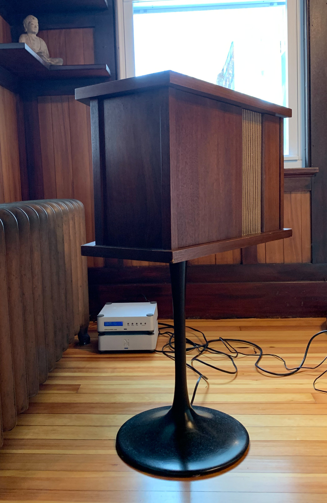

# Hugh's raspotify config

This repo contains the configuration files for the living-room stereo.

## Hardware

Loudspeakers are early-70s [Bose 901 Series II](http://cabezal.com/pix/901-minidsp-ucd/owg_en_901_series2.pdf).  These need some quite dramatic EQ, which originally would
be done with the [Bose equalizer box](http://cabezal.com/pix/901-minidsp-ucd/Bose-901-III-equal.pdf), but I'm using DSP software instead.

Amplifier is a [Wadia 151](http://www.wadia.com/ContentsFiles/151_Tech_Sheet%20web.pdf), which is basically a very nice USB DAC power-amp.

The source is a Raspberry Pi.

## Software

The stereo is configured for Spotify, Bluetooth and Airplay.

* Using [raspotify](https://github.com/dtcooper/raspotify), the Raspberry Pi shows up as a Spotify Connect device.
* Using [bluez-alsa](https://github.com/Arkq/bluez-alsa), it can be a Bluetooth speaker.
* Using [shairport-sync](https://github.com/mikebrady/shairport-sync), it's an Airplay audio device.  This is handy for movies as well as music; we can watch video on a laptop and have sound from the stereo, with quite good lip-sync.

Playback from these sources is routed via [CamillaDSP](https://github.com/HEnquist/camilladsp) to apply EQ for the loudspeakers.  The setup steps are really nicely documented [here](https://github.com/HEnquist/camilladsp-config).

* The `/etc/default/raspotify` [configuration file](https://github.com/hughpyle/raspot/blob/master/var_cache_raspotify/etc_default_raspotify) sets up 'raspotify' to play to the 'loopback' ALSA device, and adds an event handler (for notification when the track changes -- later).

* The `/lib/systemd/system/raspotify.service` [configuration file](https://github.com/hughpyle/raspot/blob/master/var_cache_raspotify/lib_systemd_system_raspotify.service) sets all the environment variables and parameters to run 'raspotify' as a service.

* The `/var/cache/raspotify` directory has the `camilladsp` executable and [configuration file](https://github.com/hughpyle/raspot/blob/master/var_cache_raspotify/dsp.conf). The DSP config in this case includes various hand-crafted artisanal IIR (biquad) filter settings to make the loudspeakers sound the way I want them to.

* The `/var/cache/raspotify/event` [script](https://github.com/hughpyle/raspot/blob/master/var_cache_raspotify/event) is work-in-progress... experiments for triggering logs and actions.

* The `/usr/local/etc` directory has the [shairport-sync.conf configuration](https://github.com/hughpyle/raspot/blob/master/usr_local_etc/shairport-sync.conf) to send Airplay output to the loopback device where it's processed by camilladsp.

--

(Wadia DAC/amp is the upper box, and Raspberry Pi is in the lower one)

